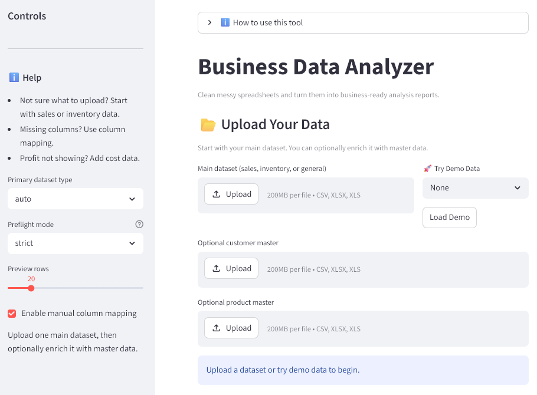
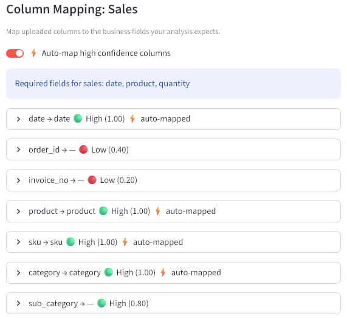
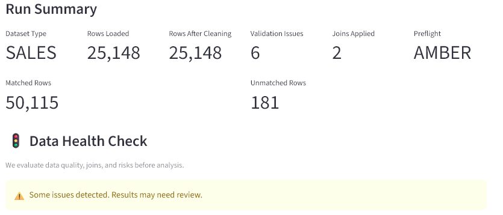
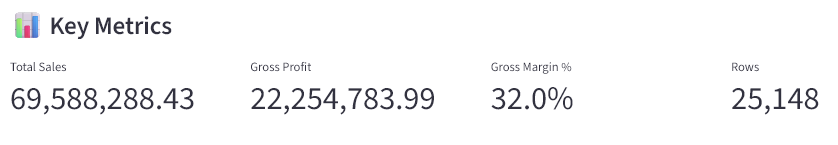
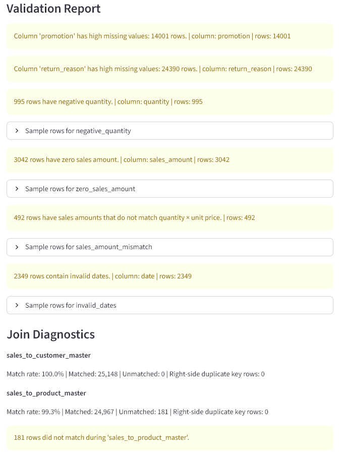
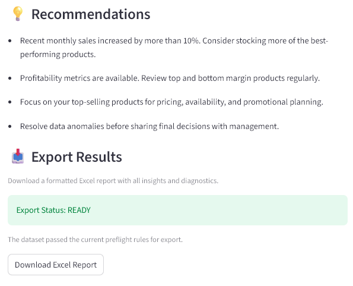
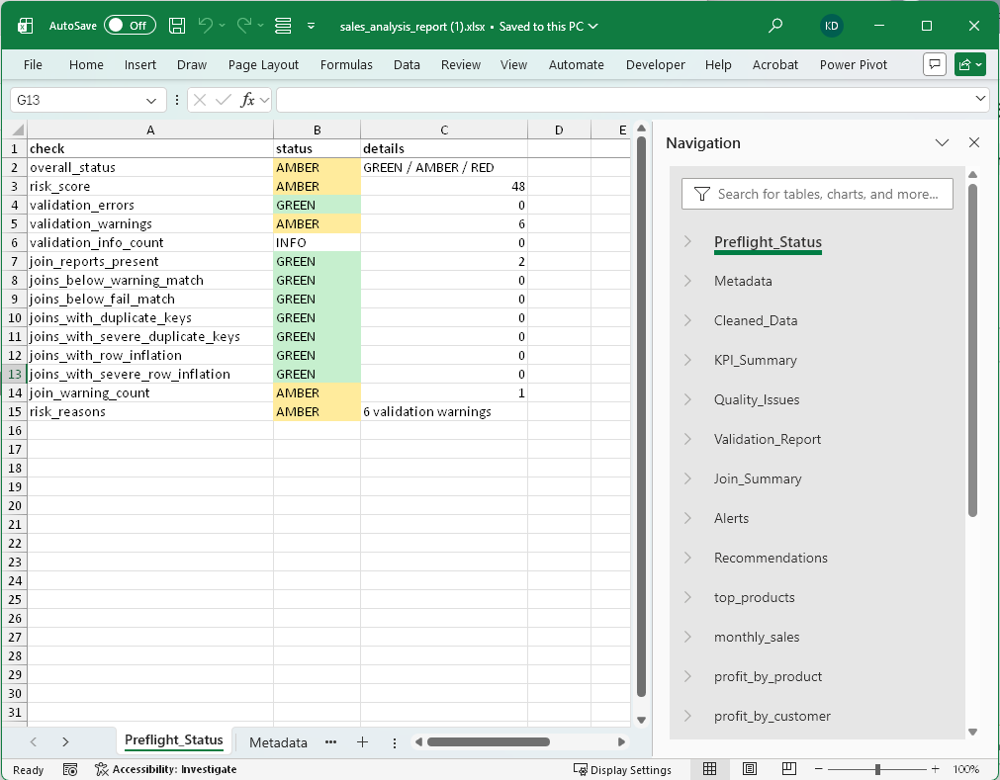

# Business Data Analyzer

A Streamlit-based desktop analytics application for business sales, inventory, and profitability analysis.

Designed for operational reporting, data validation, and rapid Excel-based analysis workflows.

---

# Overview

Business Data Analyzer helps you:

- Analyze sales and inventory data
- Validate data quality before reporting
- Detect join and mapping issues
- Calculate profitability and margins
- Export formatted Excel reports
- Explore trends and business insights

Built with:

- Python
- Streamlit
- Pandas

---

## Features

## Sales Analysis

- Revenue analysis
- Sales trends
- Product performance
- Customer performance
- Profitability analysis
- Margin analysis

---

## Inventory Analysis

- Stock visibility
- Low stock detection
- Overstock identification
- Reorder monitoring
- Supplier analysis

---

## Smart Data Preparation

- Automatic column mapping
- Alias-aware matching
- Manual mapping override
- Validation reporting
- Join diagnostics
- Preflight risk scoring

---

## Reporting

- Excel export
- Validation diagnostics
- Cleaned datasets
- Analysis summaries

---

## Screenshots
### Dashboard Overview 2

### Column Mapping 3

### Run Summary

### Key Metrics

### Validation Report

### Insights & Trends

### Recommendations & Export Results

### Excel Export


---

## Architecture

```text
app.py
services/pipeline_service.py
data_cleaning/
analytics/
reporting/
utils/
config/
```

The application follows a modular pipeline architecture:

1. Upload & ingestion
2. Cleaning & normalization
3. Validation
4. Column mapping
5. Dataset joins
6. Analytics generation
7. Export/reporting

---

## Quick Start

### Clone repository

```bash
git clone <repo-url>
cd PYThon-bus-data-analyzer
```

### Install dependencies

```bash
pip install -r requirements.txt
```

### Run application

```bash
streamlit run app.py
```

---

## Demo Data

Demo datasets are included in:

```text
/demo_data/
```

Includes:
- Sales demos
- Inventory demos
- Customer master demos
- Product master demos

---

## Distribution Build

Portable desktop Zip with launcher available in:

```text
/distribution/
```

Run:

```text
run_app.bat
```

---

## Roadmap

## v1.0

Included:

- Sales analysis
- Inventory analysis
- Profitability analysis
- Smart column mapping
- Saved mapping profiles
- Validation reporting
- Customer segmentation
- Product segmentation
- Excel export
- Demo mode

---

# Planned Features

- Forecasting
- Run history
- AI assisted matching, analysis and in depth forecasting.

---

## Tech Stack

- Python
- Streamlit
- Pandas
- NumPy
- Plotly
- OpenPyXL

---

## License

MIT License